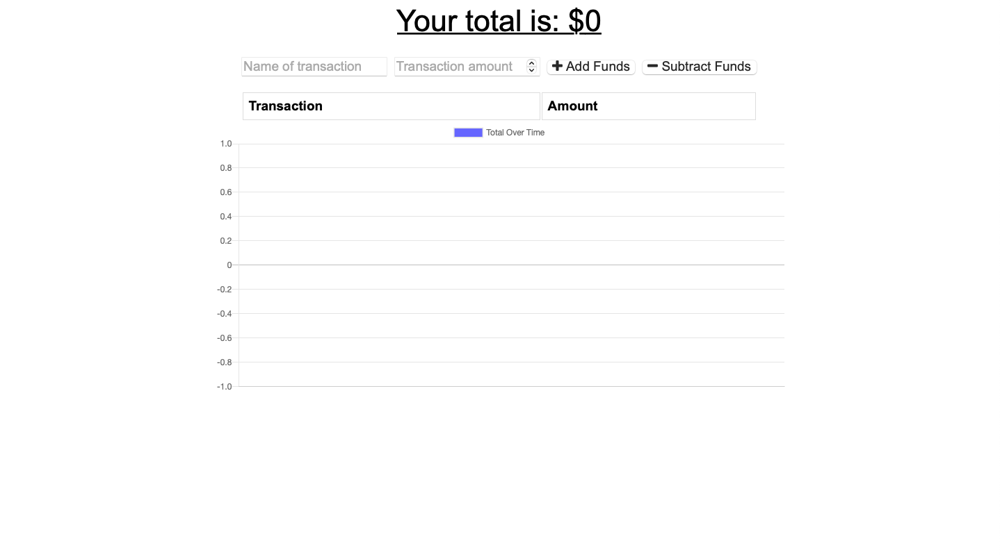

# Budget Tracker 

## Description
This PWA application allows user to add expenses and deposits to the budget with or without Internet connection. Transactions entered offline will be synchornized to the database once the application re-establishes Internet connection.

## Table of Contents
- [Installation](#installation)
- [Usage](#usage)
- [Link](#link)
- [Contribute](#contribute)

- [Questions](#questions)

## Installation
[Installing and uninstalling web apps](https://developer.mozilla.org/en-US/docs/Web/Progressive_web_apps/Installing)

## Usage
AS AN avid traveller I WANT to be able to track my withdrawals and deposits with or without a data/internet connection SO THAT my account balance is accurate when I am traveling.

## Link:
[YWK's Budget Trackers @ Heroku](https://ywk-budget-trackers.herokuapp.com)

## Contribute
If you would like to contribute, feel free to contact me by email.

## Questions
GitHub: [ywkuo227's GitHub](https://github.com/ywkuo227)

Email: [ywkuo@outlook.com](mailto:ywkuo@outlook.com)